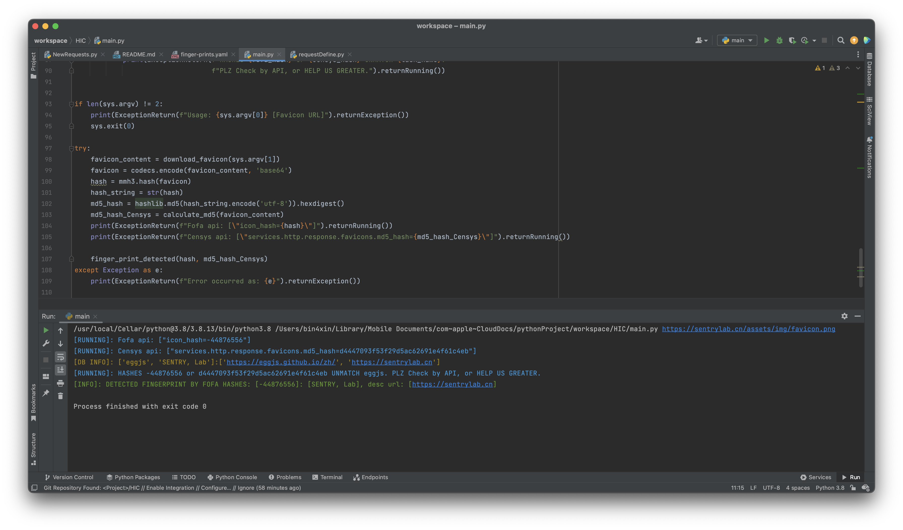
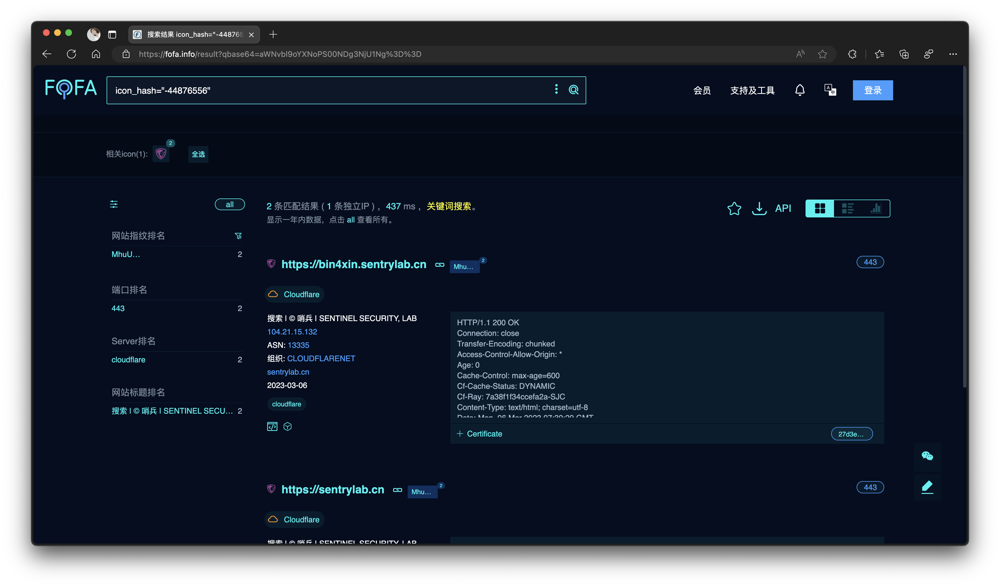

# HIC

## Hashes of favicons In Cyber

### 这是什么？

**Hashes of favicons In Cyber**项目主要涉及使用 Python 脚本从网站检索网站图标，然后计算哈希值以将其与相应的资产进行匹配。

该项目的重点是自动化收集网站图标并对其执行加密哈希的过程。 通过这样做，她可以实现各种网络安全应用程序，例如：

- 网站标识：收集的网站图标哈希值可用于唯一标识网站，有助于网站分类和跟踪。
- 完整性验证：她允许在传输或存储过程中验证图标的完整性，确保其未被篡改。
- 安全分析：安全专业人员可以使用收集的网站图标数据来分析网站是否存在潜在的安全漏洞或异常情况。
- 资产管理：将哈希值与资产相匹配可简化资产管理和跟踪，有助于网站维护和监控。

### What's this?

**Hashes of Favicons In Cyber** project primarily involves using Python scripts to retrieve favicons from websites 
and then calculate hashes to match them with corresponding assets.

This project focuses on automating the process of collecting website favicons and performing cryptographic hashing 
on them. By doing so, she enables various cybersecurity applications such as:

- Website Identification: 
  - The collected favicon hashes can be used to uniquely identify websites, helping in website categorization and tracking.
- Integrity Verification: 
  - It allows for the verification of the favicon's integrity during transmission or storage, ensuring it hasn't been tampered with.
- Security Analysis: 
  - Security professionals can use the collected favicon data to analyze websites for potential security vulnerabilities or anomalies.
- Asset Management: 
  - Matching hashes with assets simplifies asset management and tracking, aiding in website maintenance and monitoring.

## USAGE

- Terminal

```bash
python3 main.py {https://path/to/.icon/or/.png}
```

- e.g.

```bash
python3 main.py https://sentrylab.cn/assets/img/favicon.png 
```

- Output

```console
python3.8 main.py https://sentrylab.cn/assets/img/favicon.png 
[RUNNING]: Fofa api: ["icon_hash=-44876556"]
[RUNNING]: Censys api: ["services.http.response.favicons.md5_hash=d4447093f53f29d5ac62691e4f61c4eb"]
[DB INFO]: ['eggjs', 'SENTRY, Lab']:['https://eggjs.github.io/zh/', 'https://sentrylab.cn']
[RUNNING]: HASHES -44876556 or d4447093f53f29d5ac62691e4f61c4eb UNMATCH eggjs. PLZ Check by API, or HELP US GREATER.
[INFO]: DETECTED FINGERPRINT BY FOFA HASHES: [-44876556]: [SENTRY, Lab], desc url: [https://sentrylab.cn]
```

- Results:





- Verify





## Enjoy ;)